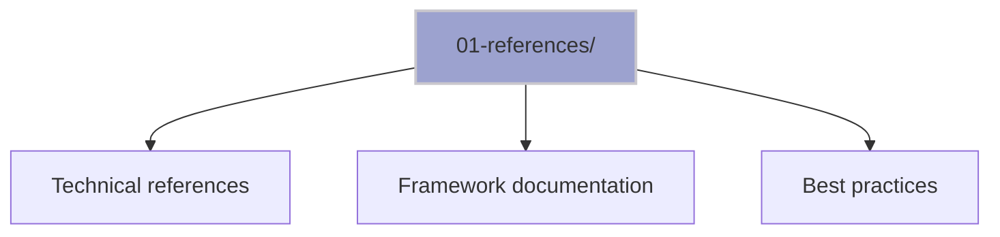
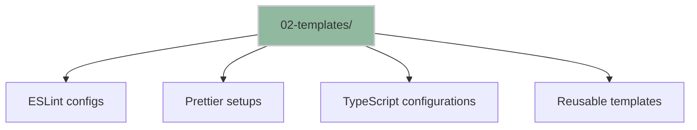
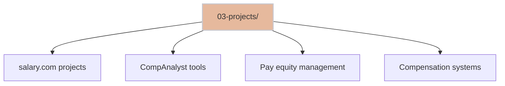
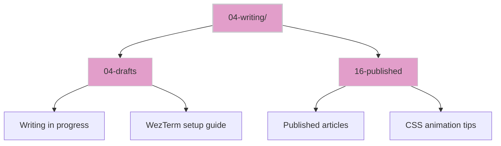

# **Inceptio**

My knowledge management tool, serving as a prototype for the personal markdown
note-taking app I'll build when time permits.

## Overview

```mermaid
graph TD
    A[Inceptio Knowledge Base] --> B[00-inbox]
    A --> C[01-references]
    A --> D[02-templates]
    A --> E[03-projects]
    A --> F[04-writing]

    style A fill:#161617,stroke:#c9c7cd,stroke-width:2px
    style B fill:#27272a
    style C fill:#9ca2cf
    style D fill:#90b99f
    style E fill:#e6b99d
    style F fill:#e29eca
```

## Structure

**Inceptio** uses a structured numbering system to organize knowledge:

### 00-inbox/

Raw incoming content, learning notes, and ideas to be processed

```mermaid
graph TD
    A[00-inbox/] --> B[New ideas & learning notes]
    A --> C[Raw incoming content]
    A --> D[Topics to process]

    style A fill:#27272a,stroke:#c9c7cd,stroke-width:2px
```

### 01-references/

Reference materials, documentation, and guides

### 02-templates/

Reusable configurations and templates for development

### 03-projects/

Project-specific documentation and work-related content

### 04-writing/

Writing projects with drafts and published content

## Workflow

1. **Capture** → Add new content to `00-inbox/`
2. **Process** → Move and refine content into appropriate sections
3. **Reference** → Use `01-references/` for quick lookups
4. **Apply** → Leverage `02-templates/` for consistent setups
5. **Document** → Track projects in `03-projects/`
6. **Share** → Publish writing through `04-writing/`

## File Naming Convention

Files use numbered prefixes for logical grouping and easy sorting:

- `01-` through `99-` for main categories
- Numbers increase with topic importance or chronological order
- Descriptive names follow the prefix for clarity
